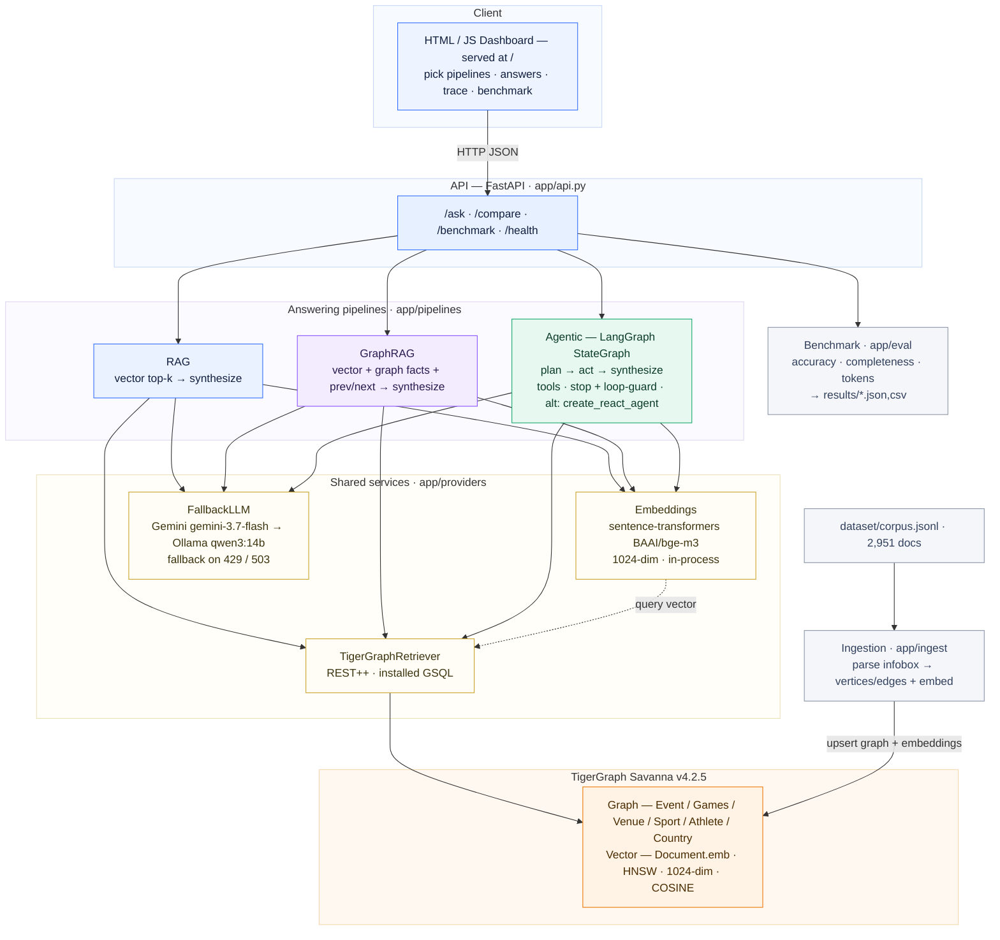

# Architecture — Olympics Investigator (Agentic GraphRAG)

Agentic GraphRAG over an Olympic-events corpus, **powered by TigerGraph Savanna**.
Every question is answered three ways — RAG, GraphRAG, and Agentic GraphRAG — and
benchmarked on accuracy, retrieval completeness, and token efficiency.

> Rendered images: [architecture.png](./architecture.png) · [architecture.svg](./architecture.svg).
> The Mermaid source below is kept for reference.

## Stack

| Layer | Choice |
|---|---|
| Graph + Vector DB | TigerGraph Savanna v4.2.5 (GSQL, native HNSW vector index) |
| DB client | pyTigerGraph (REST++, secret auth) |
| Retrieval | TigerGraph only — installed GSQL queries |
| Embeddings | sentence-transformers `BAAI/bge-m3`, 1024-dim, in-process |
| LLM | Gemini `gemini-3.7-flash` → automatic fallback to Ollama `qwen3:14b` |
| Agent framework | LangGraph `StateGraph` (default) / prebuilt `create_react_agent` |
| API + Dashboard | FastAPI serving JSON + static HTML/JS at `/` |
| Eval / tests | pandas metrics · pytest |

**Where each pipeline wins:** lookup → RAG; temporal → GraphRAG; multi-hop /
aggregation / superlative → Agentic (scans all matching events via graph
queries, which top-k retrieval cannot).
