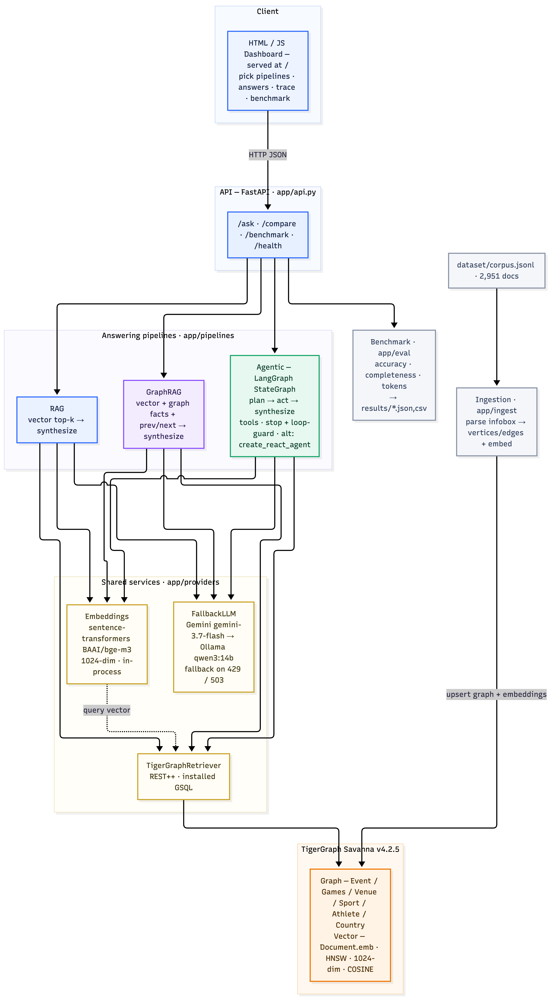

# Olympics Investigator — Agentic GraphRAG (BE)

Backend for the TigerGraph Agentic GraphRAG Hackathon. Answers questions over an
Olympic-events corpus **three ways** — RAG, GraphRAG, and Agentic GraphRAG — and
benchmarks them on accuracy, completeness, and token efficiency.

The `dataset/` folder (sibling of this one) is the source of truth and is never
modified by this backend.

## Stack

| Layer | Choice |
|---|---|
| Graph + Vector DB | TigerGraph Savanna |
| Schema + queries | GSQL (`gsql/`) |
| DB client | pyTigerGraph |
| Retrieval | TigerGraph only (vector + graph via installed GSQL) |
| LLM | Gemini `gemini-3.7-flash` (default), automatic runtime fallback to Ollama `qwen3:14b` |
| Embeddings | `sentence-transformers` `BAAI/bge-m3`, 1024-dim, in-process |
| Orchestration | LangGraph `StateGraph` (plan → act → synthesize); optional prebuilt `create_react_agent` |
| API | FastAPI (`/ask`, `/compare`, `/benchmark`, `/health`) |
| Dashboard | Static HTML/JS served by FastAPI at `/` |

## Architecture



Vector version: [BE/docs/architecture.svg](BE/docs/architecture.svg) · Mermaid source
and stack details: [BE/docs/architecture.md](BE/docs/architecture.md).

## Layout

```
BE/
  app/
    config.py           # env-driven settings
    providers/          # LLM + embedding interfaces (ollama, gemini)
    ingest/             # infobox parser + graph loader + embedder
    graph/              # TigerGraph client wrapper
    pipelines/          # rag, graphrag, agentic (share retrieval primitives)
    agent/              # LangGraph orchestrator, tools, evidence state, stopping criteria
    eval/               # benchmark runner + metrics
    api.py              # FastAPI app
  gsql/                 # GSQL schema + queries
  tests/
  requirements.txt
  .env.example
```

## Setup

```bash
cd BE
python -m venv .venv && source .venv/bin/activate
pip install -r requirements.txt
cp .env.example .env   # fill TigerGraph creds + GEMINI_API_KEY
```

A live TigerGraph connection is required (retrieval is TigerGraph-only). Run the
GSQL files first (see "GSQL setup" below).

## Providers

- **LLM defaults to Gemini.** Set `GEMINI_API_KEY` in `.env`. If it's missing,
  the app automatically falls back to Ollama `qwen3:14b`, so it still runs.
  Force local with `LLM_PROVIDER=ollama`.
- **Embeddings run on Ollama `bge-m3`** (1024-dim, matching the graph vector
  dimension). Make sure Ollama is running:

```bash
ollama list   # expect qwen3:14b and bge-m3:latest
```

`GET /health` reports the active LLM (including whether a fallback is in effect)
and whether TigerGraph is reachable.

## Run

```bash
# 1. Parse + load graph + embed docs into TigerGraph (requires live TG)
python -m app.ingest.run

# 2. Serve the API
uvicorn app.api:app --reload
#    GET  /health   POST /ask   POST /compare   POST /benchmark

# 3. Benchmark all three pipelines on the public questions
python -m app.eval.run                 # all 100, writes results/benchmark.{json,csv}
python -m app.eval.run --limit 20 --verbose

# 4. Produce answers for the hidden set
python -m app.eval.run --predict-hidden --hidden-pipeline agentic
```

### Retrieval backend

All retrieval (vector search + structured graph queries) runs on TigerGraph via
installed GSQL queries. A live TigerGraph connection is required; there is no
offline mode. Load the schema and data first (see "GSQL setup"), then run the
API or the benchmark.

## Agentic pipeline (LangGraph)

The agentic pipeline is a LangGraph `StateGraph` with three nodes:

```
START -> plan --(tool)--> act --(continue)--> plan
           |                 |
        (finish)         (decisive answer / max steps)
           v                 v
              --> synthesize --> END
```

- **plan**: the LLM picks the single next action (a tool + args, or finish) from
  the question and the evidence gathered so far. The next move is not a fixed
  sequence; it depends on what is still missing.
- **act**: runs the chosen tool, records evidence and a per-operation trace
  (tool, args, reason, seconds, tokens, docs), and applies the loop guard and
  decisive-stop rules.
- **synthesize**: produces the grounded, cited answer from accumulated evidence.

Each agentic answer carries an `agentic_meta` block (in `/ask` responses and the
benchmark) reporting steps taken, tools used, whether the strategy changed, the
stop reason, citation count, and a per-tool trace with time and tokens. That
covers the trace/agentic-behavior reporting the challenge asks for.

### Two selectable agent backends

Both are LangGraph; choose with `AGENT_IMPL`:

- `AGENT_IMPL=graph` (default) — the custom `StateGraph` above. Tighter control
  (explicit stop conditions, loop guard, evidence digest); most reliable on
  multi-step temporal chains.
- `AGENT_IMPL=react` — LangGraph's prebuilt `create_react_agent` with the
  model's native tool-calling, binding the same tools.

They share the same tools and return the same `PipelineResult` + `agentic_meta`,
so you can benchmark them head to head. On the sampled questions with
`qwen3:14b`, the custom graph scored 5/5 and the prebuilt 4/5 — the prebuilt
occasionally drops an argument or wanders on the hardest temporal multi-hop
question. Keeping both makes the "idiomatic prebuilt vs tuned custom agent"
tradeoff explicit and measurable.

## Benchmark results

Sample run over 20 public questions (`qwen3:14b` + `bge-m3`):

| Pipeline  | Accuracy | Completeness | Avg tokens |
|-----------|---------:|-------------:|-----------:|
| RAG       | 0.30 | 0.68 | 2624 |
| GraphRAG  | 0.55 | 0.68 | 3540 |
| Agentic   | 0.85 | 0.66 | 3325 |

Accuracy by question type shows *where* each approach matters:

| qtype       | RAG  | GraphRAG | Agentic |
|-------------|-----:|---------:|--------:|
| lookup      | 0.00 | 1.00 | 1.00 |
| temporal    | 0.67 | 1.00 | 0.83 |
| multi_hop   | 0.20 | 0.20 | 0.60 |
| aggregation | 0.00 | 0.33 | 1.00 |
| superlative | 0.50 | 0.50 | 1.00 |

Aggregation and superlative questions need the agent to scan *all* matching
events via graph queries; plain top-k retrieval cannot see the full set. That
is the gap the agentic pipeline closes.

## Dashboard (HTML/JS, served by FastAPI)

The dashboard is a static HTML/JS page served by the API itself at `/` — no
extra process or dependency. Vanilla JS calls the API endpoints.

```bash
uvicorn app.api:app --port 8090      # use a free port if 8000 is taken
```

Open http://localhost:8090. Two views:

- **Compare pipelines**: type a question, **choose which pipelines to run**
  (RAG / GraphRAG / Agentic checkboxes) and the agentic backend (`graph` /
  `react`), then Investigate. Results show side by side with the answer,
  tokens, citations, the agentic trace, and a token-cost chart.
- **Benchmark**: load the latest saved results or run a new benchmark;
  shows per-pipeline accuracy / completeness / tokens and accuracy by
  question type.

The header shows live backend status (LLM, embeddings, TigerGraph reachability).
Static files live in `static/` (`index.html`, `styles.css`, `app.js`).

## Tests

```bash
python -m pytest        # 30 unit tests (parser, graph builder, pipelines, agent, metrics)
```

## GSQL setup on Savanna

Paste `gsql/01_schema.gsql` then `gsql/02_queries.gsql` into the Savanna GSQL
editor and run. Set the vector `DIMENSION` to match your embedder (1024 for
bge-m3, 768 for Gemini `text-embedding-004`).
